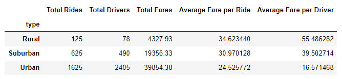

# PyBer_Analysis

# Overview of the analysis

This project is created to perform the exploratory analysis on ride-share data  to showcase the relationship between the type of city and the number of drivers and riders as well as the percentage of total fares, riders and drivers by type of city in order to help PyBer improve access to ride-sharing services and determine affordability for underserved neighborhoods. 

# Results

Looking at the table 

we can notice that there are 780 drivers more than rides  in urban cities while in rural and suburban cities there are more rides than drivers. There are also other differences between urban, suburban and rural cities. In general, the more riders and drivers - the cheaper average ride and less average fare per driver. 

For instance, there are 1625 rides in urban cities which is 13 times more than in rural cities but also there are 2405 drivers which is roughly 31 times more than in rural cities. Average fare per ride in rural cities is about 30% higher than in urban cities and average fare per driver is three times more which says that rides are probably about 30% longer in rural cities (or just more expensive) and drivers there get in average three times more work than in urban cities (if the drivers earn same amount per hour).

Comparing urban and suburban cities we can see that amount of rides is 2.6 times bigger in urban cities and the drivers number is about 5 times higher while average fare per driver is 2.4 times lower and the rides are about 20% shorter (or just cheaper).

Total fares in urban cities are about 9 times higher than in rural cities and in suburban cities it is about 4,5 times higher which is somewhat close to the rides distribution in those cities considering the difference in lengths of the rides.

Based on this analysis we can conclude that drivers are not distributed equally between rural, suburban and urban cities.

# Summary

I would suggest following recommendations for PyBer:

1. distribute extra drivers from urban cities to rural and suburban cities (considering population in those areas),
2. decrease the price for a ride for rural cities up to 30% in order to get more rides 
3. decrease the price for a ride for suburban cities up to 20% in order to get more rides.